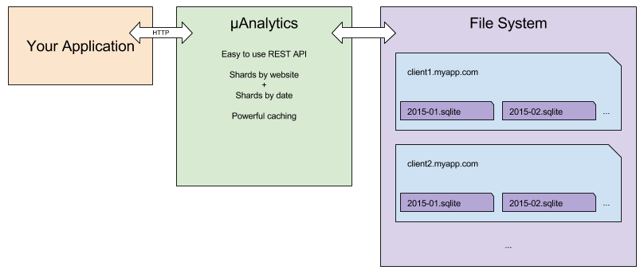

# Introduction

A small promise-based node client library for the [µAnalytics](https://github.com/GitbookIO/micro-analytics) service.

Here is an illustration of the internal design of µAnalytics:

